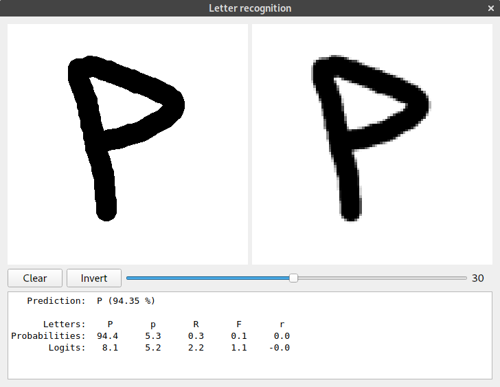
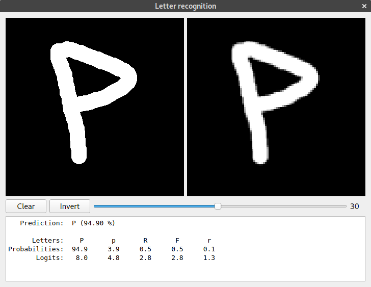
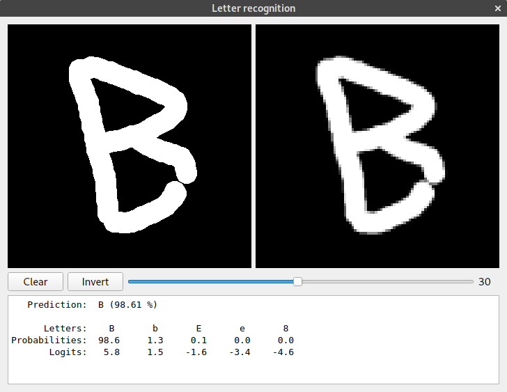
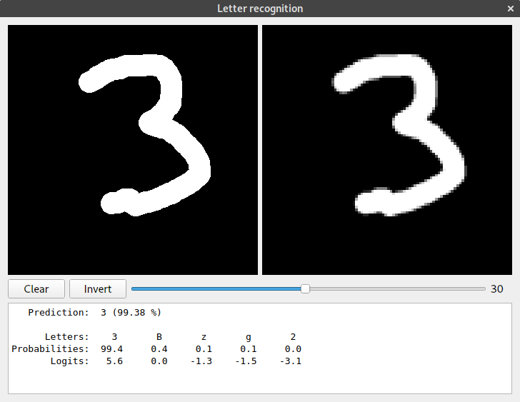

# tf-character-recognition

This project is an exploration of Tensorflow library (v1). 
It has been used to train Convolutional Neural Networks (CNNs) to recognise characters (digits, lower- and uppercase letters)
from images. 

As for the database, the [Chars74K](http://www.ee.surrey.ac.uk/CVSSP/demos/chars74k/) dataset has been used.
It contains 3 types of images: natural photos, handwritten characters (on a tablet) and images synthesised from fonts.
To download the dataset use the script at `database/chars74k/prepare_database.py`. 
This will download all the necessary files, extract them and perform the initial preperation of image files for future use.

## Current state

I've written this some time ago. Since then tensoflow had some updates, along with version v2. 
The requiremets.txt file has been generated with `pipreqs` after some time 
and it doesn't reflect the state of version from development time,
so there are multiple deprecation warnings and some things do not work at all.
This is a  big TODO, but at the moment I don't have time to fix it.

## Project organisation

```
.
├── cnn_model.py     # definitions of tensorflow models
├── cv2_show.py      # some utilities for viewing images dataset
├── database/        # all the datasets used and their loaders
├── data.py          # generalization over datasets and utilities for image destortions, etc.
├── gui.py           # PyQt GUI for testing recognition on hand written images
├── log.py           # logging
├── models/          # here tensorflow models are stored (this is gitignored)
└── run.py           # main launcher
```

The main script of interest is `run.py` (but other scripts may also provide mains for some special usage).
The models are stored in `models/` directory, but it is ignored, so first a model has to be trained before anything can be done.
Some pretrained and quite well-working models can be found in releases to avoid the time consuming training process.

## Examples 

See help:
```
python run.py -h
```

Probably the most interesting thing that is also straghtforward to use is the GUI:
```
python run.py -G
```

Some screenshots:
</img>
</img>
</img>
</img>
</img>


Another quite straightforward option is the visualization of a walk in latent space:
```
python run.p -DW
```

Download this  for an example result of latent space walk.
